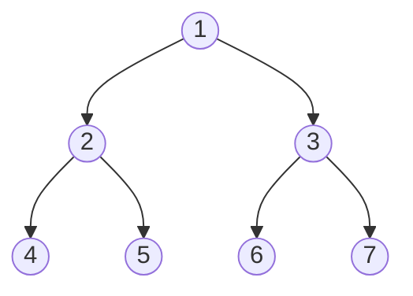
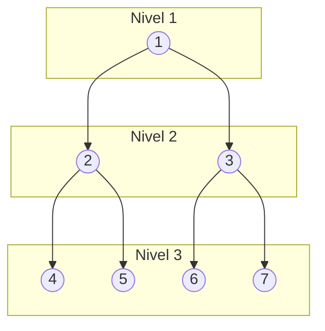
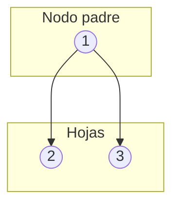
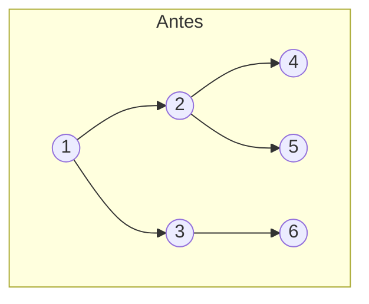
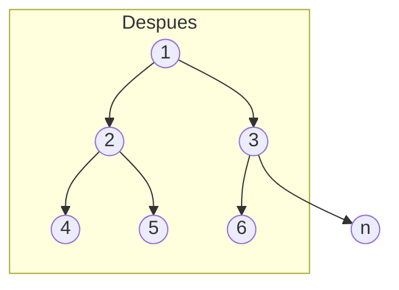
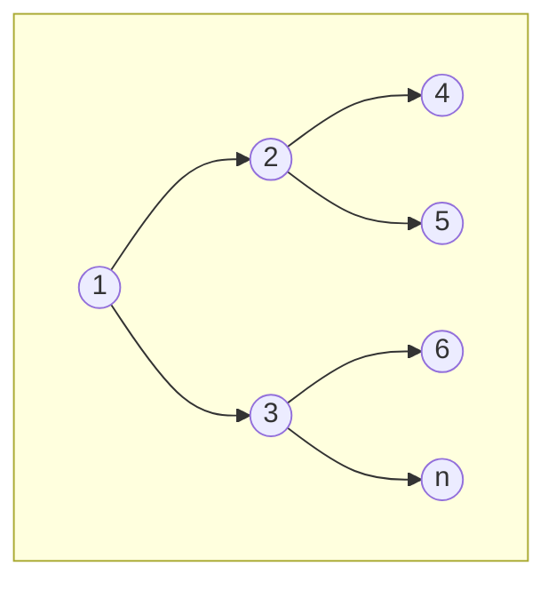
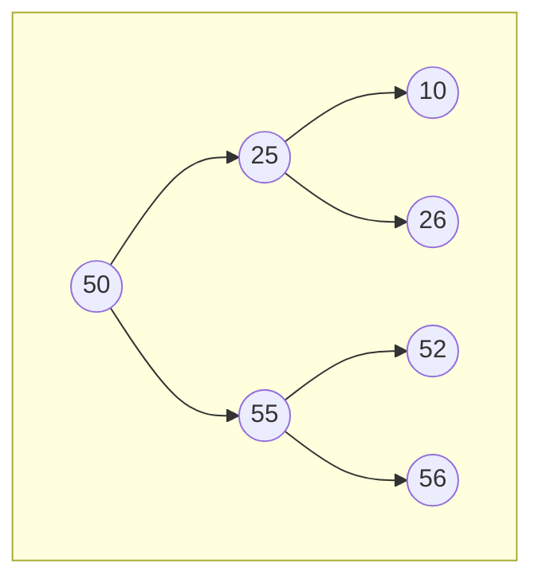

# Árboles library 🌳

*Librería de Árboles binarios implementada en C.*

_Para compilar este ejemplo_

 - _Linux_

```bash
gcc main.c -o nombrePrograma && nombrePrograma
```
 - _Windows_

```bash
gcc .\main.c -o nombrePrograma ; .\nombrePrograma
```

## Estructura del nodo del árbol  

```c
typedef struct nodo
{
	int elemento;
	struct nodo *izq, *der;
} nodo_t;
```



## Conceptos 📃

 - **Profundidad / Altura :** Representado en niveles indica que tan abajo, esta un nodo 


 
 - **Raiz / Nodo padre**: Inidica que un nodo tiene almenos 1 nodo hijo(hoja) 
 
 - **Hoja:** Se les llama hojas a los nodos a los que apunta un nodo padre, es decir, "nodos debajo de otros nodos", nomenclatura también utilizada para los nodos de mayor profundidad.
 


## Funciones que puede realizar 

### 1.  Buscar
*Busca y retorna un elemento del arbol, retorna 1 si se encontro, 0 en caso contrario*

### 2. Insertar
*Permite insertar un elemento en el mismo nivel*







Siendo n el número nuevo insertado 

### 3. imprimirNivel
*Imprime el árbol desde el nivel indicado hasta que no se encuentren más hojas* 

Teniendo el árbol A:


Salida en consola:

```bash
	     56
    55
	     52
   50
	     26
    25
	     10
```

### 4. menor
*Busca el elemento de menor cantidad, (el que está más a la izquierda)* 


Salida por consola

```bash 
10
```

### 5. mayor
*Busca el elemento de mayor cantidad, (el que está más a la derecha)* 


Salida por consola
```bash 
56
```

### 5. borrar
*Elimina un nodo del árbol reubicando si es necesario* 
NOTA: esta función retorna un árbol nuevo, sin el nodo eliminado, si se encontró, entonces se utiliza 

```c
arbol = borrar(arbol, valor);
```

### 6. nro_nodos
*Cuenta la cantidad de nodos del árbol*

### 7. borrar_arbol
*Elimina el árbol completamente*

### 8. h_arbol
*Muestra el nivel más alto del árbol (nivel de profundidad)*

### 9. inorden: (izquierdo,  raíz, derecho). 
Recorre el árbol binario no vacío en inorden (simétrico), realiza las siguientes operaciones recursivamente en cada nodo:

1.  Atraviese el sub-árbol izquierdo
2.  **Visite la raíz**
3.  Atraviese el sub-árbol derecho

### 10. preorden: (**raíz**, izquierdo, derecho). 
Recorre el árbol binario no vacío en preorden,  realiza las siguientes operaciones recursivamente en cada nodo, comenzando con el nodo de raíz:

1.  **Visite la raíz**
2.  Atraviese el sub-árbol izquierdo
3.  Atraviese el sub-árbol derecho

### 11. postorden: (izquierdo, derecho,  raíz).
Recorre el  árbol binario no vacío en postorden, realiza las siguientes operaciones recursivamente en cada nodo:

1.  Atraviese el sub-árbol izquierdo
2.  Atraviese el sub-árbol derecho
3.  **Visite la raíz**

### 12. suma
_Suma los nodos del árbol_

### 13. promedio
_Calcula el promedio de los nodos existentes en el árbol_

### 13.  sumahojas
_Suma Los nodos de mayor profundidad en el árbol_

### 14. nrohojas
_Retorna el número de hojas del árbol_

### 15.  suppMaxcosto
Retorna el mayor costo de una ruta en el árbol, el **costo** es la suma de los valores contenidos en los nodos que forman parte de la ruta, desde raíz a hoja, (para un árbol no necesariamente de búsqueda)

Debe indicar el valor de un nodo existente en el árbol, para su funcionamiento correcto 


```c
Introduzca el valor,hasta donde calcular la ruta 
10
```
```c
El costo de la ruta es 85
```
_Es decir, 50 + 25 +10_

### Otras funciones disponibles

```c   
insertarBalanceado(nodo_t  **Arbolbp, int  array[], int  lim1, int  lim2) : Insertar balanceado dado un arreglo de
 elementos,ordenados en aforma ascendente los inserta en
  el arbol, lim1 y 2 son limites superior e inferior del arreglo
``` 
```c   
maxCosto(nodo_t  *arbolbp): Retorna el maximo costo de un 
arbol
``` 

## Autores ✒️

* **Jesús Alfonzo** - *Programación* - [Alfonzzoj](https://github.com/Alfonzzoj)
